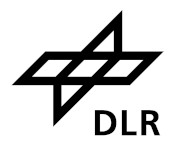

# QTurtle environment

These are the simulated turtlebot navigation environments used in [1]. Three environments as shown
below are provided, with increasing size and complexity.


## Installation
Install the dependencies via

```
pip install -r requirements.txt
```

and make this repository available in your python path, either by adjusting `sys.path`
programmatically or by adding it to the `PYTHONPATH` environment variable.

## Usage
The environment follows the OpenAI gym API, basic usage is documented `example_run.py`. To test the
environment, run:

```
ipython example_run.py -- -w 3x3
```

or `4x4` or `5x5` for the two larger worlds, which will load the environment and robot in its
starting position and launch an ipython shell that lets you interact with both.

## License
Licensed under the BSD 3-clause license, see `LICENSE` for details.

The turtlebot URDF description and 3D model are based on the [ROS](https://ros.org/) turtlebot
package, licensed under BSD 3-clause license. The package can be found [here](https://github.com/turtlebot/turtlebot).

## Acknowledgments
This work was funded by the German Federal Ministry of Economic Affairs and Climate Action (BMWK)
and German Aerospace Center e.V. (DLR e.V.) under project number 50RA2033 (DFKI) and 50RA2032
(University of Bremen) and was part of the project QINROS (Quantum Computing and Quantum Machine
Learning for Intelligent and Robotic Systems).

## References
* [1] Heimann, D., Hohenfeld, H., Wiebe, F., & Kirchner, F. (2022). *Quantum deep reinforcement learning for robot navigation tasks*. arXiv preprint [arXiv:2202.12180](https://arxiv.org/abs/2202.12180).

<a href="https://robotik.dfki-bremen.de/en/"></a>
<a href="https://www.uni-bremen.de/en/"></a>
<a href="https://www.bmwk.de/"></a>
<a href="https://www.dlr.de/"></a>

